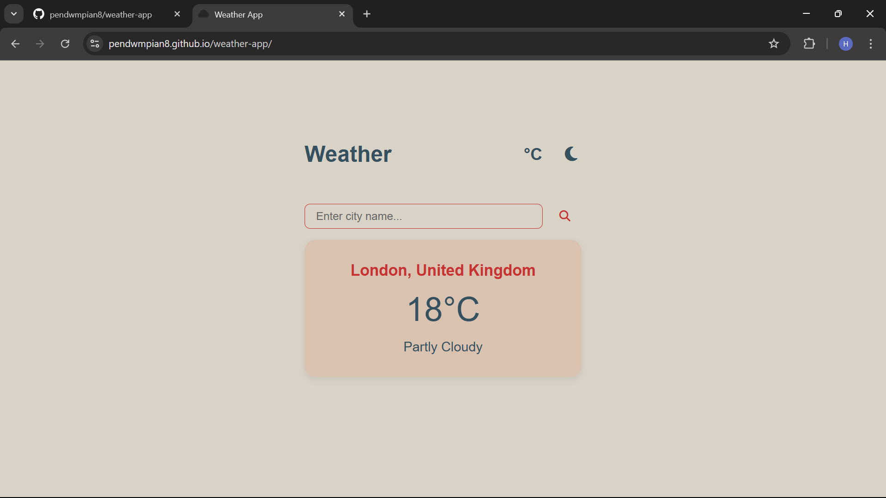
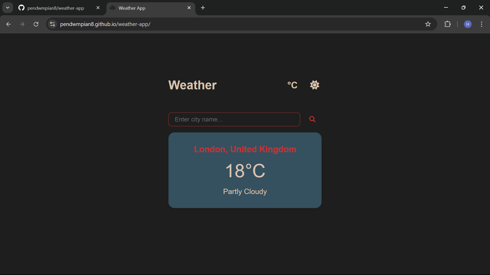
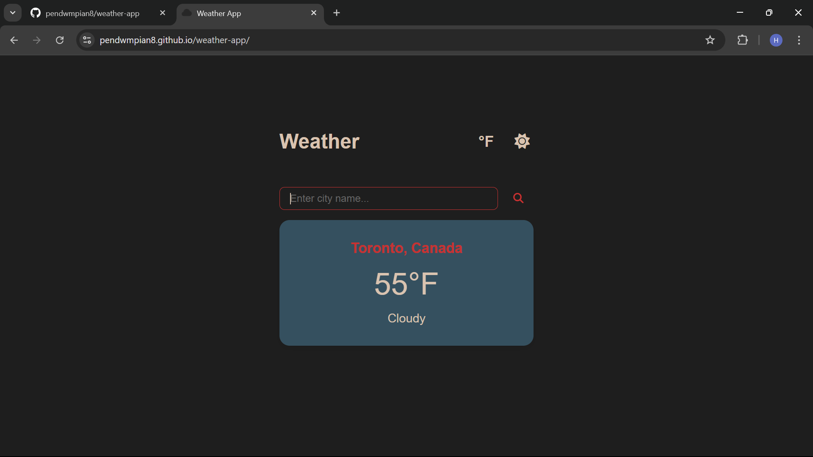
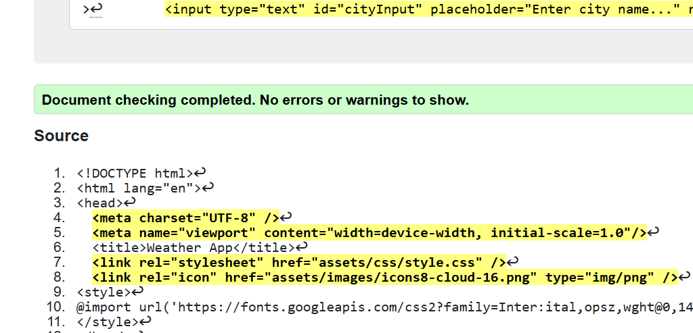
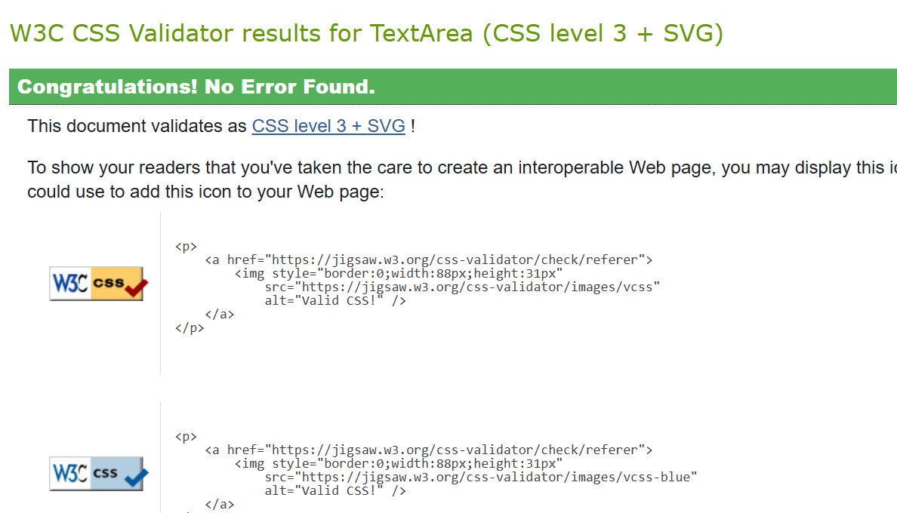
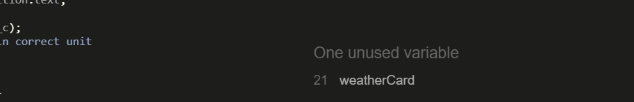
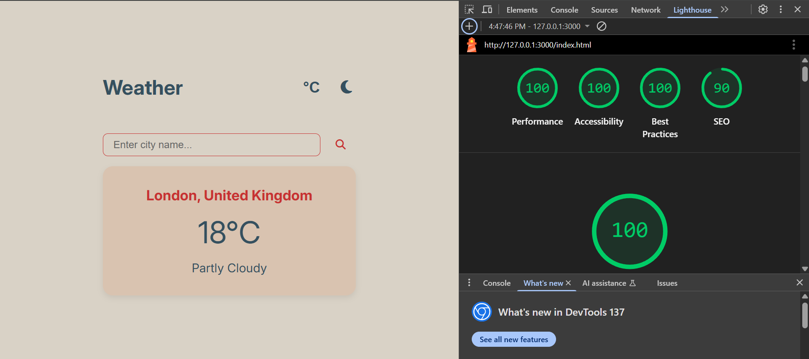

# Weather App

A minimalist, responsive weather application that uses WeatherAPI to provide real-time weather data. Designed with a clean user interface inspired by Dieter Rams colour palettes and design principles. The application includes light/dark theme toggling and the ability to switch between Celsius and Fahrenheit.

## Screenshots 

- Default page shows current London Weather in degrees celcius

- Clicking the sun/moon icon allows user to toggle between light and dark mode

- Clicking the units button allows user to toggle between farenheit and Celsius
- Using the search bar users can also select location


## Features

- Real-time weather data from WeatherAPI
- Toggle between light (day) and dark (night) modes
- Toggle between Celsius and Fahrenheit units
- Search weather by city name
- Simple and elegant user interface
- Fully responsive and built with vanilla JavaScript, HTML, and CSS


## Technologies Used

- HTML5
- CSS3
- JavaScript (ES6)
- WeatherAPI (https://www.weatherapi.com/)
- Font Awesome (for icons)
- Google Fonts 

## Validation 

- This app follows modern web standards:
- Valid HTML5 using W3C Markup Validator

- Valid CSS using W3C CSS Validator

- JavaScript validated through browser dev tools (no console errors)
- Also used JavaScript Validator and found unused variables which were then removed for improved organisation https://jshint.com/ 

- Responsive layout on mobile, tablet, and desktop

- Compatible with latest versions of Chrome, Firefox, Safari, and Edge

## Areas for improvement
- Possibly add more images to visually represent the kind of weather (e.g. rain, mist)
- Add more data such as air quality

## Getting Started

Follow these steps to set up the project locally.

### 1. Clone the Repository

```bash
git clone https://github.com/your-username/weather-app.git
cd weather-app
